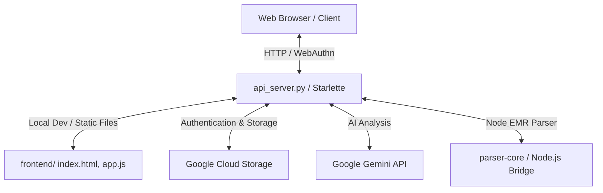

# Jisong Cloud Workspace Context Analysis

This document provides a comprehensive overview of the **Jisong Cloud** codebase, architecture, configuration, and current status.

---

## 🗺️ Project Architecture Overview

Jisong Cloud is a private personal cloud application designed around the combination of a **FastAPI/Starlette API backend**, a **static frontend featuring Apple-style aesthetics**, **Google Cloud Storage (GCS)**, and **Gemini AI integration**.



### 1. Backend (`api_server.py` & `app/`)
The backend is built with FastAPI/Starlette, exposing routes under `/api/*` and serving static frontend assets.
*   **[api_server.py](file:///Users/jsbang/Developer/00_Jisong_Cloud/01_jisong_cloud-main/api_server.py)**: Entry point, lifespan management (starts folder/drive sync), API routing, static file hosting, and request logging.
*   **[app/routers/](file:///Users/jsbang/Developer/00_Jisong_Cloud/01_jisong_cloud-main/app/routers)**: Contains sub-routers:
    *   `auth.py`: WebAuthn passkey registration/login and password fallback.
    *   `files.py`: File listing, upload, download, deletion, and batch ZIP compression.
    *   `memos.py`: Memo CRUD (stored as `.txt` files in GCS).
    *   `tools.py`: Helper endpoints (Markdown to PDF, text cleaning, settlements).
    *   `v6.py`: Node parser bridge endpoints.
    *   `settings.py`: Configuration details.
*   **Core Services (`app/`)**:
    *   `storage.py`: Interaction with files.
    *   `memo.py`: Memo storage and formatting.
    *   `ai.py`: Gemini API integrations, token calculations, and usage log handling.
    *   `security.py` & `passkeys.py`: Authentication, PBKDF2 hashing, and WebAuthn.
    *   `folder_sync.py` & `drive_sync.py`: Sync utilities.
    *   `v6_bridge.py`: Local bridge to the TypeScript EMR parser.

### 2. Frontend (`frontend/`)
The frontend is a single-page application (SPA) serving static HTML and vanilla JS, following high-fidelity Apple web design guidelines.
*   **[frontend/index.html](file:///Users/jsbang/Developer/00_Jisong_Cloud/01_jisong_cloud-main/frontend/index.html)**: Main structure using template placeholders.
*   **[frontend/app.js](file:///Users/jsbang/Developer/00_Jisong_Cloud/01_jisong_cloud-main/frontend/app.js)**: State management, routing, API calls, and event bindings.
*   **[frontend/styles.css](file:///Users/jsbang/Developer/00_Jisong_Cloud/01_jisong_cloud-main/frontend/styles.css)**: Comprehensive stylesheet implementing CSS custom properties for color palettes, spacing, and typography.
*   **[frontend/partials/](file:///Users/jsbang/Developer/00_Jisong_Cloud/01_jisong_cloud-main/frontend/partials)**: HTML fragments (`home.html`, `files.html`, `memos.html`, `ai.html`, `tools.html`, `settings.html`, `login.html`) dynamically loaded into the main page.

### 3. Parser Core (`parser-core/`)
A Node.js/TypeScript-based parser specialized in EMR (Electronic Medical Record) ingestion, splitting, and normalization (e.g., dividing labs, medications, imaging, pathology, and notes).
*   Built with TypeScript and compiled to standard JS.
*   Interfaced from the Python server via `app/v6_bridge.py` using CLI calls.

---

## 🎨 Design System & Styling Rules (`DESIGN.md`)

The UI is optimized for a premium, clean aesthetic resembling Apple's official web pages:
*   **Typography**: SF Pro / Inter font family. Display titles use a tight tracking (`letter-spacing: -0.01em` to `-0.02em` or negative pixel values). Body text defaults to `17px` instead of `16px`.
*   **Colors**:
    *   Primary: Action Blue (`#0066cc`) for all interactive buttons/links on light pages.
    *   Dark backgrounds: Near-Black surfaces (`#272729`, `#2a2a2c`) and pure black for the global navigation.
    *   Parchment canvas: Off-white (`#f5f5f7`) for footers and page structure alternating cards.
*   **Elevations**: UI features zero gradients and exactly **one** drop-shadow (`rgba(0, 0, 0, 0.22) 3px 5px 30px`) reserved strictly for floating/resting product rendering. Everything else is flat or uses soft hairlines (`1px rgba(0, 0, 0, 0.08)` border).
*   **Radii**: Simple, specific values:
    *   Pill (`9999px`): primary blue CTAs, search inputs.
    *   Large (`18px`): utility/accessories grid cards.
    *   Small (`8px`): buttons, card inner image radius.

---

## 🚦 Verification & Local Development

### Python Environment
*   Virtual environment: `.venv`
*   Run Unit Tests (49 tests):
    ```bash
    .venv/bin/python -m unittest discover -s tests/python
    ```
*   Run API Server Locally:
    ```bash
    .venv/bin/uvicorn api_server:app --host 127.0.0.1 --port 8080 --reload
    ```
*   Syntax Compilation Check:
    ```bash
    python3 -m py_compile api_server.py app/*.py
    ```

### Node Environment
*   Location: `parser-core/`
*   Type Check:
    ```bash
    cd parser-core && npm run check
    ```
*   JS Syntax Check:
    ```bash
    node --check frontend/app.js
    ```

---

## 🛠️ Security & Storage Structures

*   **Bucket Layout (GCS)**:
    *   `uploads/` - Target for arbitrary files.
    *   `memos/` - Extracted plain text documents.
    *   `logs/` - Usage metadata (`gemini_usage.json`) and system logging (`access_log.json`).
    *   `auth/` - PBKDF2 hashed password (`account_password.txt`), sessions (`account_sessions.json`), and passkeys (`passkeys.json`).
*   **Access Rules**:
    *   Cloudflare Access controls the outermost perimeter (targeting `jsbang01357@gmail.com`).
    *   Fallback fallback authorization mechanisms include passkey verification (`/api/auth/passkey/*`) and Owner login password ID fallback.
